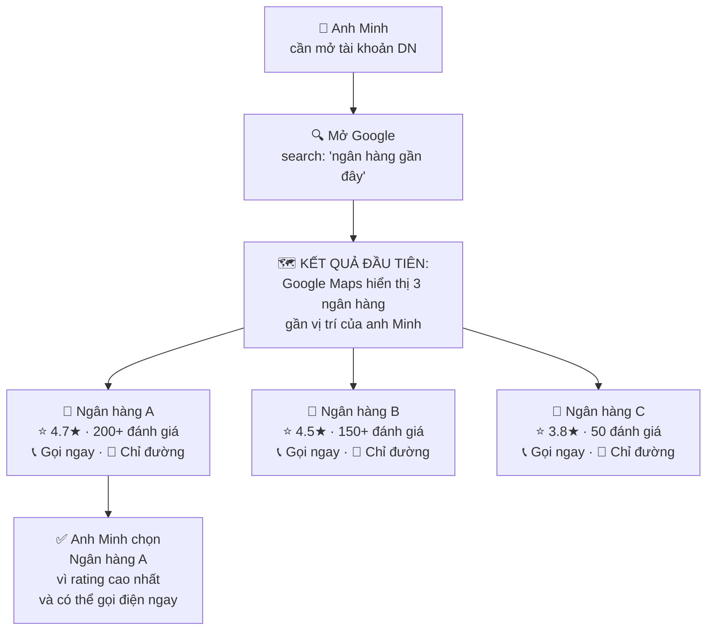
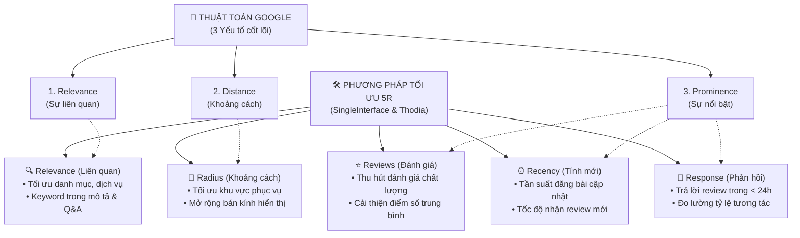
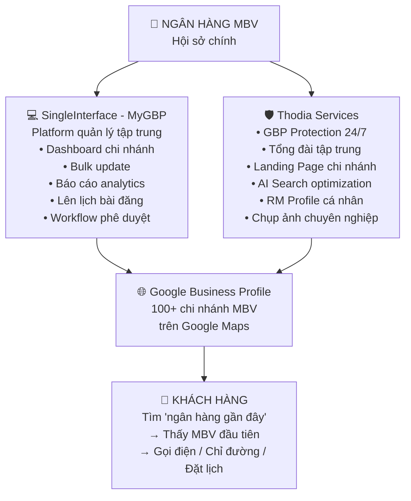
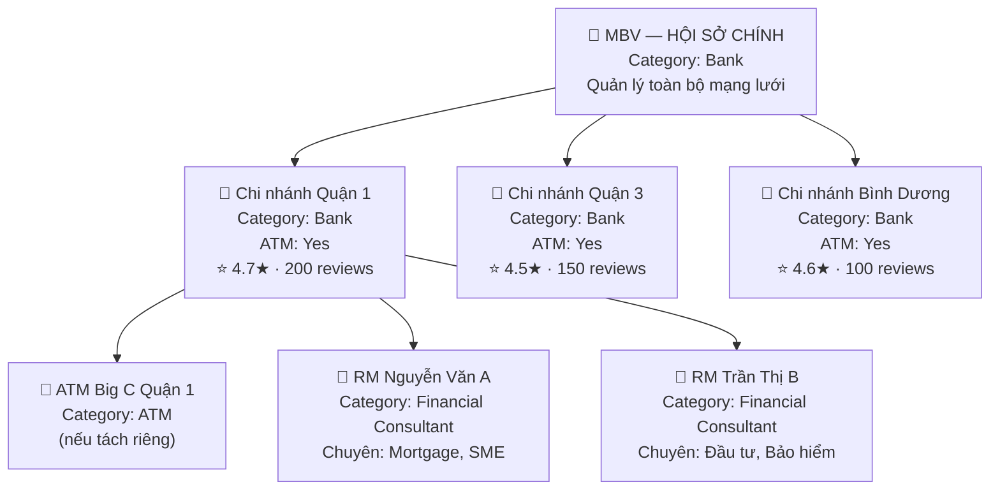
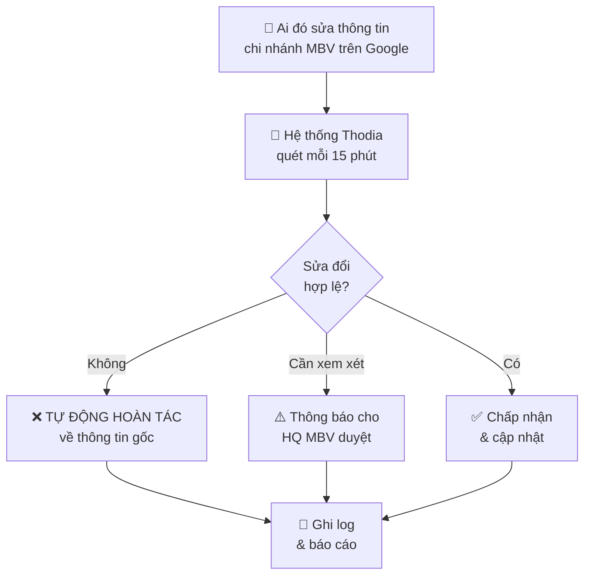
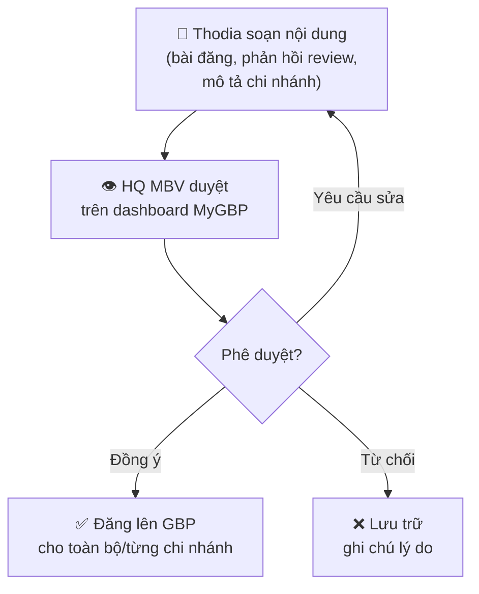
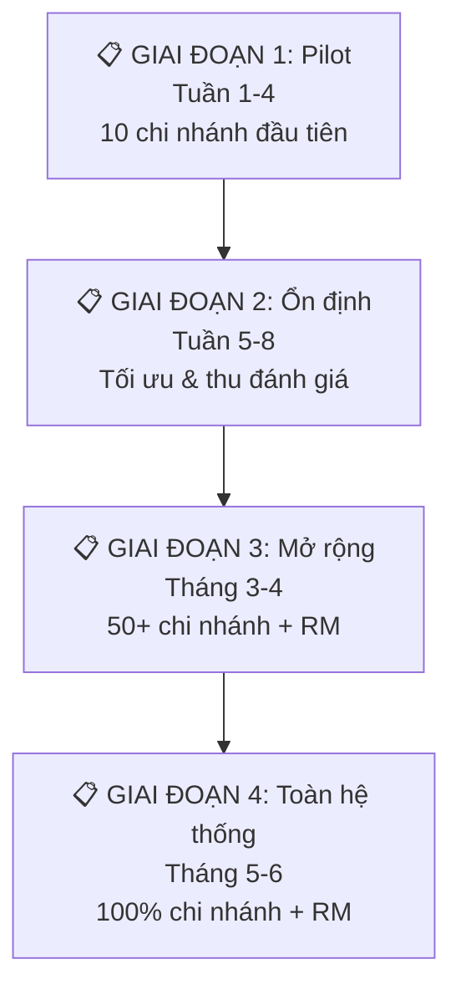

# Proposal: Giải pháp Tối ưu Google Business Profile cho Ngân hàng MBV

> **Đơn vị đề xuất:** SingleInterface (Beta.vn) & Thodia  
> **Sản phẩm:** MyGBP — Google Business Profile Management Platform  
> **Khách hàng:** Ngân hàng MBV  
> **Ngày:** 07/06/2026  
> **Phiên bản:** 1.0

---

## Mục lục

1. [Tóm tắt Đề xuất](#1-tóm-tắt-đề-xuất)
2. [Vấn đề: Tại sao Ngân hàng MBV cần quan tâm Google Maps?](#2-vấn-đề-tại-sao-ngân-hàng-mbv-cần-quan-tâm-google-maps)
3. [Google Business Profile là gì? (Giải thích đơn giản)](#3-google-business-profile-là-gì-giải-thích-đơn-giản)
4. [Giải pháp kết hợp: SingleInterface × Thodia](#4-giải-pháp-kết-hợp-singleinterface--thodia)
5. [Chi tiết Giải pháp cho Ngân hàng MBV](#5-chi-tiết-giải-pháp-cho-ngân-hàng-mbv)
6. [Quy trình Triển khai & Lộ trình](#6-quy-trình-triển-khai--lộ-trình)
7. [KPI & Đo lường Hiệu quả](#7-kpi--đo-lường-hiệu-quả)
8. [Tại sao chọn SingleInterface & Thodia?](#8-tại-sao-chọn-singleinterface--thodia)
9. [Mô hình Giá](#9-mô-hình-giá)
10. [Bước tiếp theo](#10-bước-tiếp-theo)
11. [Phụ lục](#11-phụ-lục)
12. [Version History](#12-version-history)

---

## 1. Tóm tắt Đề xuất

### Một câu duy nhất

> **Mỗi ngày, hàng nghìn người tìm "ngân hàng gần đây" trên Google. Nếu chi nhánh MBV không xuất hiện trong top 3 kết quả đầu tiên, khách hàng sẽ đến ngân hàng đối thủ.**

### Giải pháp

SingleInterface & Thodia đề xuất **gói giải pháp toàn diện** để giúp Ngân hàng MBV:

| # | Mục tiêu | Giải pháp |
|---|---------|----------|
| 1 | **Xuất hiện đầu tiên** trên Google Maps khi khách tìm "ngân hàng gần đây" | Tối ưu Google Business Profile cho toàn bộ chi nhánh |
| 2 | **Biến mỗi nhân viên RM** thành "cố vấn tài chính" trên Google | Tạo profile GBP cá nhân cho Relationship Managers |
| 3 | **Quản lý tập trung** 100+ chi nhánh từ 1 dashboard | MyGBP platform của SingleInterface |
| 4 | **Bảo vệ thông tin** chi nhánh khỏi chỉnh sửa trái phép | GBP Protection tự động từ Thodia |
| 5 | **Không mất khách** khi nhân viên nghỉ việc | Tổng đài tập trung + quản lý ownership linh hoạt |
| 6 | **Đo lường rõ ràng** hiệu quả từng chi nhánh, từng RM | Dashboard analytics real-time |

### Kết quả kỳ vọng (sau 6 tháng)

| Chỉ số | Hiện tại (ước tính) | Mục tiêu |
|--------|---------------------|---------|
| Chi nhánh xuất hiện top 3 Google Maps | < 20% | **≥ 60%** |
| Cuộc gọi từ Google Maps / tháng | Không đo được | **500+ cuộc** |
| Lượt xin chỉ đường / tháng | Không đo được | **1,000+ lượt** |
| Đánh giá trung bình chi nhánh | ~3.5★ | **≥ 4.5★** |
| Tỷ lệ phản hồi đánh giá | < 10% | **100% trong 24h** |

---

## 2. Vấn đề: Tại sao Ngân hàng MBV cần quan tâm Google Maps?

### 2.1. Khách hàng tìm ngân hàng ở đâu?

Hãy tưởng tượng: **Anh Minh cần mở tài khoản doanh nghiệp.** Anh ấy sẽ làm gì?



**Vấn đề:** Nếu MBV **không có** trong 3 kết quả đầu tiên → anh Minh **sẽ không bao giờ biết** MBV có chi nhánh gần đó.

### 2.2. Google Maps hiển thị TRƯỚC website

Khi khách hàng tìm kiếm, kết quả hiển thị theo thứ tự này:

| Thứ tự | Khu vực | Ai xuất hiện? | Khách hàng thấy gì? |
|--------|---------|--------------|---------------------|
| **#1 — Trên cùng** | 🗺️ **Google Maps (Map Pack)** | **CHỈ 3 ngân hàng** gần nhất, tốt nhất | Tên, sao đánh giá, nút gọi điện, nút chỉ đường |
| #2 — Bên dưới | 🔗 Website | Tất cả các website ngân hàng | Link trang web, cần click vào rồi tìm chi nhánh |

> **Điểm mấu chốt:** 3 kết quả trên Google Maps nhận được **70% tổng số click**. Nếu MBV không ở trong top 3 → mất 70% khách hàng tiềm năng cho đối thủ.

### 2.3. Khách hàng HÀNH ĐỘNG ngay từ Google Maps

Khác với website (khách phải đọc, tìm, navigate), Google Maps cho phép khách hàng hành động **ngay lập tức**:

| Hành động | Trên Google Maps | Trên Website MBV |
|-----------|-----------------|-------------------|
| **Gọi điện** | 1 tap → gọi ngay | Tìm trang "Liên hệ" → copy số → gọi |
| **Xin chỉ đường** | 1 tap → mở bản đồ dẫn đường | Tìm trang "Chi nhánh" → tìm quận → copy địa chỉ |
| **Xem đánh giá** | Thấy ngay: 4.7★, 200 reviews | Không có tính năng này |
| **Đặt lịch hẹn** | 1 tap → đặt lịch (nếu bật) | Tìm form → điền thông tin → chờ xác nhận |

> **Kết luận:** Google Maps là **"cửa trước số 1"** của mọi chi nhánh ngân hàng. Nếu cửa này trông xấu, thiếu thông tin, hoặc tệ hơn — không tồn tại — khách hàng sẽ đi cửa khác (ngân hàng đối thủ).

### 2.4. Thách thức hiện tại của Ngân hàng MBV (dự kiến)

| # | Thách thức | Hậu quả |
|---|-----------|---------|
| 1 | **Thông tin chi nhánh không đầy đủ** trên Google | Khách tìm không thấy, hoặc thấy thông tin sai |
| 2 | **Giờ mở cửa sai** (đặc biệt ngày lễ) | Khách đến cửa đóng → thất vọng → đánh giá xấu |
| 3 | **Đánh giá thấp, không được phản hồi** | Khách mới thấy reviews xấu → chọn đối thủ |
| 4 | **Không có ảnh chuyên nghiệp** | Chi nhánh trông không đáng tin |
| 5 | **Mỗi chi nhánh quản lý riêng lẻ** (hoặc không ai quản lý) | Không nhất quán, không kiểm soát được |
| 6 | **Ai đó sửa thông tin** trên Google (bất kỳ ai cũng có thể "Suggest an edit") | Số điện thoại bị đổi, giờ mở cửa bị sai, thậm chí bị đánh dấu "Đã đóng cửa" |
| 7 | **RM (Relationship Manager) không có sự hiện diện online** | Khách muốn tìm "tư vấn tài chính gần đây" → không thấy RM của MBV |

---

## 3. Google Business Profile là gì? (Giải thích đơn giản)

### 3.1. Giải thích như cho bé lớp 5

> **Google Business Profile (GBP)** giống như **tấm danh thiếp khổng lồ** mà Google tự động hiển thị khi ai đó tìm kiếm.

Hãy tưởng tượng bạn mở **một trang sách** về chi nhánh ngân hàng:

| Phần | Nội dung | Ví dụ |
|------|---------|-------|
| 📛 **Tên** | Tên chi nhánh | "MBV — Chi nhánh Quận 1" |
| ⭐ **Sao đánh giá** | Khách hàng cũ cho bao nhiêu sao | ⭐⭐⭐⭐⭐ 4.8/5 (200 đánh giá) |
| 📍 **Địa chỉ** | Ở đâu | "123 Nguyễn Huệ, Quận 1, TP.HCM" |
| ⏰ **Giờ mở cửa** | Mở lúc nào | "T2-T6: 8:00-17:00, T7: 8:00-12:00" |
| 📞 **Số điện thoại** | Gọi cho ai | "1900-xxxx" → Bấm là gọi ngay |
| 📸 **Ảnh** | Trông như thế nào | Ảnh ngoài, ảnh trong, ảnh nhân viên |
| 💬 **Đánh giá** | Khách nói gì | "Nhân viên rất nhiệt tình, giúp tôi mở tài khoản nhanh chóng" |
| 📰 **Tin mới** | Có gì mới | "Lãi suất tiết kiệm ưu đãi tháng 6: 8%/năm" |
| ❓ **Hỏi & Đáp** | Câu hỏi thường gặp | "Mở tài khoản doanh nghiệp cần gì?" |

**Google tự động hiển thị "tấm danh thiếp" này** khi ai đó tìm kiếm — MIỄN PHÍ. Nhưng nếu thông tin sai, thiếu, hoặc không được chăm sóc → Google sẽ **hiển thị đối thủ thay vì bạn**.

### 3.2. Tại sao GBP quan trọng cho Ngân hàng?

| So sánh | Cách cũ (Website + App) | Cách mới (GBP + Website + App) |
|---------|------------------------|-------------------------------|
| **Khách tìm thấy bạn** | Phải biết tên MBV, gõ website, tải app | Google **tự hiển thị** khi khách ở gần |
| **Chi phí** | Chạy quảng cáo Google Ads → tốn tiền | GBP là **miễn phí** → chỉ cần tối ưu |
| **Độ tin cậy** | Website tự nói về mình | Google Reviews = **khách hàng thật nói** |
| **Tốc độ chuyển đổi** | 5-7 bước để liên hệ | **1 tap** gọi điện hoặc chỉ đường |
| **Phủ sóng** | 1 website duy nhất | **Mỗi chi nhánh = 1 "mặt tiền số"** riêng |

### 3.3. Ví dụ: 3 yếu tố xếp hạng cốt lõi của Google & Phương pháp tối ưu 5R

Để đưa chi nhánh MBV vào **top 3 hiển thị** (Map Pack), thuật toán Google dựa trên 3 yếu tố cốt lõi. Từ đó, SingleInterface & Thodia phát triển phương pháp tối ưu **5R** toàn diện để đo lường, quản lý và tối ưu hóa thứ hạng chi nhánh.



> **Nguyên tắc quản trị:** *"Không đo lường được thì không quản lý & tối ưu được"*. Với 5R, mọi hành động từ tối ưu thông tin đến chăm sóc khách hàng đều được chuẩn hóa bằng số liệu cụ thể (Response Rate, Review Velocity, Ranking Radius) hiển thị real-time trên Dashboard.

---

## 4. Giải pháp kết hợp: SingleInterface × Thodia

### 4.1. Ai làm gì?

> **SingleInterface** cung cấp **platform công nghệ** (MyGBP) — công cụ quản lý hàng trăm chi nhánh từ 1 dashboard.  
> **Thodia** cung cấp **dịch vụ giá trị gia tăng** — tối ưu nội dung, bảo vệ profile, tổng đài, landing page, AI search.

| Thành phần | SingleInterface (MyGBP) | Thodia |
|-----------|------------------------|--------|
| **Nền tảng quản lý GBP** | ✅ Dashboard quản lý 100+ chi nhánh | — |
| **Cập nhật bulk** (giờ mở cửa, thông tin) | ✅ 1 click cho toàn bộ chi nhánh | — |
| **Tạo & quản lý bài đăng** | ✅ Lên lịch, template, duyệt content | — |
| **Báo cáo & analytics** | ✅ Dashboard chi tiết per chi nhánh | — |
| **Tối ưu nội dung GBP** | — | ✅ Viết mô tả, Q&A, dịch vụ cho từng chi nhánh |
| **GBP Protection** | — | ✅ Tự động chặn chỉnh sửa trái phép 24/7 |
| **Tổng đài hotline tập trung** | — | ✅ Mọi cuộc gọi từ GBP được ghi nhận |
| **Landing Page cho chi nhánh** | — | ✅ Trang web riêng, chuẩn Local SEO |
| **Tối ưu AI Search (GEO)** | — | ✅ Xuất hiện trên ChatGPT, Perplexity, Google AI |
| **RM Profile cá nhân** | — | ✅ Tạo GBP cá nhân cho Relationship Managers |
| **Chụp ảnh & video 360°** | — | ✅ Ảnh chuyên nghiệp cho từng chi nhánh |

### 4.2. Mô hình kết hợp — Nhìn tổng thể



### 4.3. Giá trị cộng hưởng — 1 + 1 = 3

| Nếu chỉ dùng SingleInterface | Nếu chỉ dùng Thodia | Kết hợp cả hai |
|----|----|----|
| ✅ Quản lý bulk tốt | ✅ Tối ưu nội dung sâu | ✅ Quản lý bulk + Tối ưu sâu |
| ❌ Thiếu nội dung chất lượng | ❌ Khó quản lý 100+ chi nhánh | ✅ Scale lên 100+ chi nhánh dễ dàng |
| ❌ Không có GBP Protection | ❌ Dashboard chưa enterprise-grade | ✅ Enterprise dashboard + Protection |
| ❌ Không có tổng đài | ❌ Không có workflow phê duyệt HQ | ✅ Tổng đài + Workflow compliance |


---

## 5. Chi tiết Giải pháp cho Ngân hàng MBV

### 5.1. Mạng lưới Location — Mô hình "Hub & Spoke" cho Ngân hàng

> **Ý tưởng cốt lõi:** Càng nhiều "điểm hiện diện" chất lượng trên Google Maps → càng chiếm nhiều vị trí hiển thị → đối thủ càng khó chen vào.



**Giải thích đơn giản:**
- Mỗi **chi nhánh** = 1 "cửa hàng số" trên Google Maps
- Mỗi **RM** = 1 "cố vấn tài chính cá nhân" trên Google Maps  
- Khi khách search "ngân hàng gần đây" → có thể thấy **cả chi nhánh MBV và RM của MBV** trong top 3

### 5.2. Giải pháp #1 — Tối ưu Chi nhánh (Core)

#### Mỗi chi nhánh sẽ được tối ưu gì?

| Hạng mục | Trước tối ưu | Sau tối ưu |
|----------|-------------|-----------|
| **Tên** | "MBV" (chung chung) | "MBV — Chi nhánh Quận 1" (rõ ràng) |
| **Danh mục** | Bank (1 danh mục) | Bank + ATM + Financial Consultant + Mortgage Lender (4 danh mục) |
| **Mô tả** | Trống hoặc copy từ website | Mô tả riêng 750 ký tự: dịch vụ cụ thể, phòng VIP, khu vực ATM |
| **Giờ mở cửa** | Sai hoặc thiếu ngày lễ | Chính xác 100%, bao gồm giờ ngày lễ, cập nhật tự động |
| **Ảnh** | 0-5 ảnh mờ | 50+ ảnh chuyên nghiệp: ngoại thất, nội thất, ATM, phòng VIP |
| **Đánh giá** | 3.5★, ít đánh giá, không phản hồi | Chiến lược thu đánh giá, phản hồi 100% trong 24h |
| **Bài đăng** | Không có | 2-4 bài/tuần: lãi suất, khuyến mãi, sự kiện |
| **Q&A** | Không có | 10+ câu hỏi thường gặp: giờ mở cửa, ATM, dịch vụ, thủ tục |
| **Dịch vụ** | Không liệt kê | Đầy đủ: Tiết kiệm, Vay mua nhà, Vay doanh nghiệp, Chuyển tiền, Thẻ tín dụng |
| **Landing Page** | Không có | Trang riêng cho chi nhánh, chuẩn Local SEO, mapping 100% với GBP |

### 5.3. Giải pháp #2 — RM Profile cá nhân (Breakthrough)

> **Ý tưởng:** Mỗi Relationship Manager trở thành **"cố vấn tài chính cá nhân"** trên Google Maps. Khi khách tìm "tư vấn vay mua nhà Quận 1" → thấy RM của MBV.

| Yếu tố | Chi tiết |
|---------|---------|
| **Tên GBP** | `Nguyễn Văn A - MBV Chi nhánh Quận 1` |
| **Danh mục** | Financial Consultant |
| **Mô tả** | "Chuyên tư vấn: vay mua nhà, tài khoản doanh nghiệp, đầu tư. 8 năm kinh nghiệm tại MBV." |
| **Đánh giá** | Thu từ khách hàng RM đã phục vụ → reviews CÁ NHÂN |
| **Ảnh** | Headshot chuyên nghiệp, ảnh tại chi nhánh, ảnh với khách hàng |
| **Số điện thoại** | Số tổng đài Thodia (không phải số cá nhân) → khi RM nghỉ, không mất liên lạc |

**Tại sao điều này quan trọng?**

```
Kịch bản: Khách tìm "tư vấn vay mua nhà Quận 1"

Kết quả trên Google Maps:
1. 🏦 MBV Chi nhánh Quận 1 → Map Pack slot 1
2. 👤 RM Nguyễn Văn A - MBV Q1 → Map Pack slot 2
3. 🏦 Ngân hàng đối thủ X → Map Pack slot 3

→ MBV chiếm 2/3 vị trí, đối thủ chỉ còn 1 slot!
```

### 5.4. Giải pháp #3 — GBP Protection (Bảo vệ 24/7)

> **Vấn đề:** Bất kỳ ai cũng có thể "Suggest an edit" trên Google — thay đổi giờ mở cửa, số điện thoại, thậm chí đánh dấu "Đã đóng vĩnh viễn". Google **KHÔNG cho phép** tắt tính năng này.

**Giải pháp của Thodia:**



**Tại sao ngân hàng CẦN GBP Protection nhất?**
- Đối thủ hoặc kẻ xấu có thể cố tình sửa thông tin chi nhánh
- 1 sai sót nhỏ (giờ mở cửa sai) = khách đến cửa đóng = khiếu nại = mất uy tín
- Với 100+ chi nhánh, **không thể kiểm tra thủ công** mỗi ngày

### 5.5. Giải pháp #4 — Tổng đài Hotline tập trung

> **Vấn đề thực tế:** Khách gọi số cá nhân RM → RM nghỉ việc → MBV mất hoàn toàn liên lạc với khách hàng đó.

**Giải pháp:**

| Tính năng | Mô tả |
|----------|-------|
| **Số tổng đài riêng cho MBV** | Tất cả GBP hiển thị số tổng đài (không phải số cá nhân) |
| **Routing thông minh** | Khách gọi từ GBP chi nhánh Q1 → tự động chuyển đến Q1 |
| **RM Matching** | Khách gọi hỏi vay mua nhà → tự động match với RM chuyên mortgage |
| **Ghi nhận mọi cuộc gọi** | Mọi cuộc gọi được log: ai gọi, từ đâu, kéo dài bao lâu |
| **RM nghỉ việc** | Số tổng đài giữ nguyên → cuộc gọi tự động chuyển cho RM mới |
| **Báo cáo** | Dashboard: bao nhiêu cuộc gọi/chi nhánh, thời gian chờ, tỷ lệ nghe máy |

### 5.6. Giải pháp #5 — "Rate Alert" Auto-Posts (Đột phá)

> **Ý tưởng sáng tạo:** Tự động tạo bài đăng GBP khi lãi suất thay đổi.

**Cách hoạt động:**

```
HQ MBV cập nhật lãi suất mới
        ↓
Hệ thống tự động tạo bài đăng cho TỪNG chi nhánh:
        ↓
📰 "Lãi suất vay mua nhà TẠI CHI NHÁNH QUẬN 1: 7.5%/năm 
    Liên hệ RM Nguyễn Văn A để được tư vấn chi tiết."
        ↓
Hiển thị ngay trên Google Maps khi khách xem chi nhánh
```

**Giá trị:** Biến **100+ chi nhánh** thành **100+ "bảng quảng cáo số"** cập nhật lãi suất real-time. Không ngân hàng nào ở Việt Nam đang làm điều này.

### 5.7. Giải pháp #6 — "Branch Health Score" Dashboard (Enterprise)

> **Quản lý 100+ chi nhánh** cần công cụ đánh giá "sức khỏe" từng chi nhánh.

| Tiêu chí | Điểm tối đa | Ví dụ chi nhánh "khoẻ" | Ví dụ chi nhánh "yếu" |
|----------|-------------|------------------------|----------------------|
| Profile hoàn thiện | 20 điểm | 100% thông tin → 20/20 | 60% thông tin → 12/20 |
| Review velocity | 20 điểm | 10+ reviews/tháng → 20/20 | 0 reviews/tháng → 0/20 |
| Response rate | 20 điểm | 100% phản hồi → 20/20 | 30% phản hồi → 6/20 |
| Post frequency | 20 điểm | 4+ posts/tuần → 20/20 | 0 posts → 0/20 |
| Giờ mở cửa chính xác | 20 điểm | 100% đúng → 20/20 | Sai ngày lễ → 15/20 |
| **TỔNG** | **100** | **🟢 100/100 — Tuyệt vời** | **🔴 33/100 — Cần can thiệp** |

HQ MBV nhận cảnh báo tự động khi chi nhánh có Health Score < 70 → can thiệp ngay.

### 5.8. Giải pháp #7 — Tối ưu AI Search (Tương lai)

> **Xu hướng 2025-2026:** Người dùng ngày càng hỏi AI thay vì search truyền thống. Khi ai đó hỏi ChatGPT: "ngân hàng nào có lãi suất vay mua nhà tốt nhất TP.HCM?" → MBV PHẢI xuất hiện trong câu trả lời.

**Thodia đảm bảo MBV xuất hiện trên:**
- ✅ Google AI Overviews (kết quả AI trên Google Search)
- ✅ ChatGPT (khi người dùng hỏi về ngân hàng)
- ✅ Perplexity AI
- ✅ Cốc Cốc (trình duyệt phổ biến tại VN)

### 5.9. Giải pháp #8 — Compliance Workflow (Dành riêng cho Ngân hàng)

> **Thực tế ngân hàng:** Mọi nội dung công khai phải được HQ phê duyệt. Thodia & SingleInterface thiết kế workflow riêng cho yêu cầu này.



**Template đã được phê duyệt sẵn:**
- Mẫu phản hồi đánh giá tích cực (3 mẫu)
- Mẫu phản hồi đánh giá tiêu cực (3 mẫu) — không hứa hẹn, không tiết lộ thông tin nhạy cảm
- Mẫu Q&A về lãi suất, thủ tục, giờ mở cửa
- Mẫu bài đăng: khuyến mãi, lãi suất, sự kiện cộng đồng


---

## 6. Quy trình Triển khai & Lộ trình

### 6.1. Lộ trình 4 giai đoạn (6 tháng)



### 6.2. Chi tiết từng giai đoạn

#### Giai đoạn 1: Pilot (Tuần 1-4)

| Tuần | Hành động | Deliverables | KPI |
|------|----------|-------------|-----|
| **T1** | Thu thập thông tin 10 chi nhánh (NAP, ảnh, giờ mở cửa, dịch vụ) | Form onboarding hoàn thành | 100% data collected |
| **T2** | Tạo/tối ưu 10 GBP + 10 landing page + setup tổng đài | 10 GBP live, tổng đài active | Profile 100% complete |
| **T3** | Submit verification + activate GBP Protection | Pending → Verified | Zero suspension |
| **T4** | Go-live: bài đăng đầu tiên, Q&A, bắt đầu thu đánh giá | 20+ bài đăng, 50+ Q&A | First reviews incoming |

#### Giai đoạn 2: Ổn định (Tuần 5-8)

| Hành động | KPI Target |
|----------|-----------|
| Campaign thu đánh giá: target 10 reviews/chi nhánh | ≥ 100 reviews tổng, ≥ 4.5★ |
| 2 bài đăng/tuần cho mỗi chi nhánh | 80+ bài đăng |
| Phản hồi 100% đánh giá trong 24h | Response rate 100% |
| Monitor Map Pack: tracking keyword rankings | Top 3 cho ≥ 30% keywords |
| Holiday Hours bulk update (nếu có ngày lễ) | 100% chính xác |

#### Giai đoạn 3: Mở rộng (Tháng 3-4)

| Hành động | KPI Target |
|----------|-----------|
| Scale lên 50+ chi nhánh | 50+ GBP verified |
| Onboard 20 RM đầu tiên (SAB profiles) | 20 RM profiles live |
| Launch Rate Alert auto-posts | Auto-posts khi lãi suất đổi |
| Launch Branch Health Score dashboard | HQ theo dõi real-time |
| Tổng đài mở rộng: RM Matching active | Calls → match đúng RM |

#### Giai đoạn 4: Toàn hệ thống (Tháng 5-6)

| Hành động | KPI Target |
|----------|-----------|
| 100% chi nhánh live | 100+ GBP verified |
| Toàn bộ RM có profile | 50+ RM profiles |
| AI Search optimization active | MBV xuất hiện trên ChatGPT, Google AI |
| Full ROI report | ROI > 300% |
| Đề xuất scale/optimize cho năm tiếp theo | Strategy plan cho Y2 |

### 6.3. Workflow vận hành hàng ngày (sau go-live)

| Tần suất | Hoạt động | Ai thực hiện |
|----------|----------|-------------|
| **Hàng ngày** | Phản hồi đánh giá (< 24h), kiểm tra GBP Protection alerts | Thodia + Hệ thống tự động |
| **2x/tuần** | Đăng bài GBP (dùng template đã duyệt) | Thodia (HQ duyệt trước) |
| **Hàng tuần** | Báo cáo ngắn: cuộc gọi, chỉ đường, đánh giá tuần | Thodia → HQ MBV |
| **2 tuần/lần** | Họp sync: review progress, feedback, điều chỉnh | Thodia + HQ MBV |
| **Hàng tháng** | Báo cáo đầy đủ: KPIs, Map Pack ranking, ROI | Thodia → HQ MBV |
| **Hàng quý** | Review chiến lược: mở rộng, thêm dịch vụ, gia hạn | Thodia + SingleInterface + HQ MBV |

---

## 7. KPI & Đo lường Hiệu quả

> **Nguyên tắc:** Không đo lường được thì không quản lý & tối ưu được.

### 7.1. KPIs cấp Chi nhánh (Đo từng GBP)

| KPI | Mô tả giản đơn | Tần suất | Target |
|-----|----------------|---------|--------|
| **Search Views** | Bao nhiêu lần chi nhánh xuất hiện khi khách tìm kiếm | Hàng tháng | +10-15%/tháng |
| **Maps Views** | Bao nhiêu lần xuất hiện trên Google Maps | Hàng tháng | +10-15%/tháng |
| **Calls** | Bao nhiêu cuộc gọi từ Google Maps | Hàng tuần | Tăng dần |
| **Direction Requests** | Bao nhiêu lần khách xin chỉ đường | Hàng tháng | +5-10%/tháng |
| **Website Clicks** | Bao nhiêu lần khách click vào website | Hàng tháng | +10%/tháng |
| **Review Count** | Tổng số đánh giá | Hàng tháng | +5-10/tháng |
| **Review Rating** | Điểm đánh giá trung bình | Hàng tháng | ≥ 4.5★ |
| **Response Rate** | % đánh giá được phản hồi | Hàng tuần | 100% trong 24h |

### 7.2. KPIs cấp Mạng lưới (Đo toàn hệ thống MBV)

| KPI | Mô tả giản đơn | Target |
|-----|----------------|--------|
| **Map Pack Coverage** | % từ khoá mà MBV xuất hiện top 3 | ≥ 60% |
| **Total Interactions** | Tổng cuộc gọi + chỉ đường + clicks + bookings | 1,000+/tháng |
| **Cost per Interaction** | Chi phí / Tổng tương tác | Giảm dần |
| **Branch Health Score** | % chi nhánh đạt 80+ điểm | ≥ 90% |
| **AI Citation Rate** | Số lần MBV xuất hiện trong câu trả lời AI | Tăng dần |

### 7.3. KPIs cấp Kinh doanh (ROI thật)

| KPI | Cách đo | Mục tiêu |
|-----|---------|---------|
| **Cost per Lead (CPL)** | Chi phí / Leads từ GBP | Thấp hơn kênh quảng cáo hiện tại |
| **Lead to Account Conversion** | Tài khoản mới / Leads GBP | Benchmark nội bộ |
| **Return on Investment** | (Giá trị KH mới từ GBP - Chi phí) / Chi phí | > 300% trong 6 tháng |

### 7.4. Dashboard — HQ MBV thấy gì?

| Section | Nội dung | Truy cập |
|---------|---------|---------|
| **Overview** | Tổng quan toàn mạng lưới: tổng calls, directions, reviews | HQ |
| **Branch Ranking** | Xếp hạng chi nhánh theo Health Score | HQ |
| **RM Performance** | Xếp hạng RM theo calls, reviews | HQ + Branch Manager |
| **Review Alerts** | Đánh giá 1-2 sao cần xử lý gấp | HQ + Branch Manager |
| **Protection Log** | Các chỉnh sửa trái phép đã bị chặn | HQ |
| **Rate Alert History** | Bài đăng lãi suất đã tự động đăng | HQ |

---

## 8. Tại sao chọn SingleInterface & Thodia?

### 8.1. Đối thủ KHÔNG LÀM ĐƯỢC điều này

| Yếu tố | Website MBV | App MBV | Quảng cáo Google Ads | **SingleInterface + Thodia** |
|---------|------------|---------|---------------------|-----------------------------|
| Xuất hiện trên Map Pack | ❌ | ❌ | ❌ (Ads ≠ Map Pack) | ✅ |
| Click-to-Call trực tiếp | ❌ | ❌ | ✅ (tốn tiền) | ✅ (miễn phí) |
| Chỉ đường 1 tap | ❌ | ❌ | ❌ | ✅ |
| Đánh giá từ khách thật | ❌ | ❌ | ❌ | ✅ |
| Bảo vệ thông tin 24/7 | ❌ | ❌ | ❌ | ✅ |
| Tối ưu AI Search | ❌ | ❌ | ❌ | ✅ |
| Chi phí per lead | Cao | Rất cao (dev + maint) | Tốn tiền mỗi click | Thấp (fixed monthly) |

### 8.2. Lợi thế cạnh tranh

| # | Lợi thế | Giải thích |
|---|---------|-----------|
| 1 | **First-mover advantage** | Hầu hết ngân hàng VN chưa tối ưu GBP chi nhánh → MBV chiếm trước = chiếm lâu dài |
| 2 | **Moat (hào phòng thủ)** | Portal/fintech KHÔNG THỂ tạo GBP vì không có chi nhánh thật → chỉ ngân hàng thật mới có thể |
| 3 | **RM Profile = blue ocean** | Hiện tại CHƯA có RM ngân hàng nào ở VN có GBP cá nhân → MBV là đầu tiên |
| 4 | **Chi phí cực thấp so với giá trị** | 1 khách hàng vay mua nhà = doanh thu hàng trăm triệu đồng. Chi phí GBP = vài chục nghìn/chi nhánh/tháng |
| 5 | **Đo lường rõ ràng** | Mỗi cuộc gọi, mỗi lượt chỉ đường đều được tracking → biết chính xác ROI |

### 8.3. Xử lý băn khoăn thường gặp

| Băn khoăn | Trả lời |
|----------|---------|
| "MBV đã có website, cần gì GBP?" | Website nằm BÊN DƯỚI Map Pack. GBP xuất hiện TRÊN CÙNG + khách gọi điện trực tiếp mà không cần vào website. |
| "GBP miễn phí, tại sao cần trả phí?" | GBP giống như **đất trống miễn phí**. SingleInterface & Thodia là **kiến trúc sư + quản lý tòa nhà + tổng đài + bảo vệ 24/7**. Có đất mà không xây nhà thì không ai ở. |
| "Sợ nhân viên nghỉ mất data?" | Tổng đài tập trung giữ mọi data. GBP ownership linh hoạt. Zero risk. |
| "Sợ Google thay đổi chính sách?" | Team Thodia theo dõi Google guidelines 24/7 và adapt nhanh. Chi nhánh ngân hàng là entity hợp lệ nhất trên GBP. |
| "Mất bao lâu thấy kết quả?" | Tuần 1-2: Profile hoàn thiện. Tháng 1-2: Xuất hiện Map Pack. Tháng 3-6: ROI rõ ràng. |
| "Compliance nội dung có đảm bảo?" | Workflow: Thodia soạn → HQ MBV duyệt → mới đăng. Template phản hồi đã được review trước. |

---

## 9. Mô hình Giá

### 9.1. Cấu trúc phí SingleInterface (MyGBP Platform)

| Hạng mục | Mô tả | Đơn giá |
|----------|-------|---------|
| **Setup Fee** (1 lần) | Cài đặt platform, onboarding, training | Theo số locations |
| **Monthly Fee** | Phí sử dụng platform hàng tháng | Theo số locations (giảm dần theo quy mô) |

> Công thức giá monthly: `INT(336÷√n+2.5)` USD/location/tháng (với n = số locations)
>
> **Ví dụ:** 100 chi nhánh → ~$39.7/chi nhánh/tháng | 200 chi nhánh → ~$28.9/chi nhánh/tháng

### 9.2. Cấu trúc phí Thodia (Added Services)

| Dịch vụ | Mô tả | Ghi chú |
|---------|-------|---------|
| **Tối ưu nội dung GBP** | Viết mô tả, Q&A, services cho từng chi nhánh | Theo phạm vi |
| **GBP Protection** | Monitor & auto-revert 24/7 | Phí hàng tháng |
| **Tổng đài Hotline** | Routing, ghi nhận, báo cáo cuộc gọi | Phí hàng tháng |
| **Landing Page** | Trang riêng cho từng chi nhánh | Setup + maintenance |
| **Chụp ảnh 360°** | Ảnh chuyên nghiệp cho chi nhánh | Theo chi nhánh |
| **RM Profile** | Tạo & quản lý GBP cho RM | Phí hàng tháng/RM |
| **AI Search (GEO)** | Tối ưu xuất hiện trên AI platforms | Phí hàng tháng |
| **Rate Alert Auto-Posts** | Tự động đăng bài khi lãi suất đổi | Phí hàng tháng |
| **Báo cáo & Analytics** | Dashboard + báo cáo tuần/tháng | Đi kèm gói |

> [!NOTE]
> Giá cụ thể sẽ được trình bày trong buổi họp chi tiết, tùy thuộc vào:
> - Số lượng chi nhánh
> - Số lượng RM cần profile
> - Các dịch vụ bổ sung được chọn
> - Thời hạn hợp đồng

### 9.3. ROI minh hoạ — Tại sao đáng đầu tư?

| Phép tính | Số liệu |
|----------|---------|
| Chi phí GBP (100 chi nhánh × $40/tháng) | ~$4,000/tháng (~105M VNĐ) |
| + Dịch vụ Thodia (Protection, Hotline, Content) | Tuỳ gói |
| = **Tổng chi phí ước tính** | **~150-250M VNĐ/tháng** |
| | |
| Khách hàng mới từ GBP (ước tính 50 leads/tháng) | — |
| × Tỷ lệ chuyển đổi (20%) = 10 khách mới/tháng | — |
| × Giá trị trung bình 1 khách (vay mua nhà = 500M VNĐ, lãi 5 năm) | — |
| = **Doanh thu tiềm năng** | **Hàng tỷ VNĐ/tháng** |
| | |
| **ROI** | **> 1,000%** |

---

## 10. Bước tiếp theo

### 10.1. Đề xuất Pilot

| Bước | Thời gian | Nội dung |
|------|----------|---------|
| **1. Buổi Demo** | 1 buổi (60 phút) | Demo live: search "ngân hàng gần [vị trí MBV]" trên Google → chỉ ra cơ hội |
| **2. Audit miễn phí** | 3-5 ngày | Phân tích GBP hiện tại của 5 chi nhánh MBV vs 5 chi nhánh đối thủ → báo cáo |
| **3. Pilot 3 tháng** | 3 tháng | 10 chi nhánh + 5 RM → đo lường KPIs → báo cáo ROI |
| **4. Scale** | Sau pilot | Mở rộng toàn bộ mạng lưới nếu pilot thành công |

### 10.2. Cam kết

| Cam kết | Chi tiết |
|---------|---------|
| ✅ **KPI rõ ràng** | Cam kết số cuộc gọi, lượt chỉ đường tối thiểu |
| ✅ **Báo cáo minh bạch** | Dashboard real-time, báo cáo tuần/tháng |
| ✅ **Compliance** | Workflow phê duyệt nội dung theo yêu cầu MBV |
| ✅ **Không mất data** | Tổng đài tập trung + ownership linh hoạt |
| ✅ **Bảo vệ 24/7** | GBP Protection tự động |
| ✅ **Hỗ trợ liên tục** | Account Manager riêng cho MBV |

---

## 11. Phụ lục

### 11.1. Thuật ngữ

| Thuật ngữ | Giải thích đơn giản |
|----------|-------------------|
| **GBP (Google Business Profile)** | "Danh thiếp số" của doanh nghiệp trên Google Maps |
| **Map Pack** | 3 kết quả đầu tiên trên Google Maps khi tìm kiếm |
| **NAP** | Name, Address, Phone — phải nhất quán trên mọi nền tảng |
| **SAB (Service Area Business)** | Loại GBP ẩn địa chỉ, chỉ hiện vùng phục vụ (dùng cho RM) |
| **Local SEO** | Tối ưu để xuất hiện khi khách tìm "gần đây" |
| **Review Velocity** | Tốc độ nhận đánh giá mới — càng nhanh, Google càng ưu tiên |
| **GEO** | Generative Engine Optimization — tối ưu để xuất hiện trên AI (ChatGPT, Perplexity) |
| **Landing Page** | Trang web riêng cho từng chi nhánh, mapping 100% với GBP |
| **Schema Markup** | Mã kỹ thuật trên landing page giúp Google hiểu thông tin chi nhánh chính xác |
| **RM** | Relationship Manager — nhân viên quản lý khách hàng tại ngân hàng |

### 11.2. Ví dụ Template phản hồi Đánh giá (đã phù hợp Compliance Ngân hàng)

**Đánh giá tích cực (4-5★):**

> "Cảm ơn [Tên] đã tin tưởng MBV chi nhánh [X]! Chúng tôi luôn nỗ lực mang lại dịch vụ tốt nhất. Nếu cần hỗ trợ thêm, vui lòng liên hệ hotline [số]."

**Đánh giá tiêu cực (1-3★):**

> "Cảm ơn phản hồi của [Tên]. Chúng tôi rất tiếc về trải nghiệm chưa tốt. Vui lòng liên hệ hotline [số] để đội ngũ hỗ trợ giải quyết trực tiếp cho bạn."

**Q&A mẫu:**

| Câu hỏi | Trả lời |
|---------|---------|
| "Lãi suất tiết kiệm hiện tại bao nhiêu?" | "Lãi suất tiết kiệm tại chi nhánh [X]: từ Y%/năm (kỳ hạn 12 tháng). Liên hệ RM [Tên] qua [số tổng đài] để được tư vấn gói phù hợp nhất." |
| "Mở tài khoản doanh nghiệp cần gì?" | "Cần: Giấy ĐKKD, CMND/CCCD người đại diện, con dấu. Đặt lịch hẹn trước qua [link/số] để được phục vụ ưu tiên." |
| "Chi nhánh có phòng VIP không?" | "Có, chi nhánh [X] có phòng VIP phục vụ khách hàng ưu tiên. Liên hệ [số] để đặt lịch." |

### 11.3. Cách các chi nhánh MBV bổ trợ nhau trên Google Maps

```
Kịch bản: Khách tìm "vay mua nhà lãi suất thấp Quận 1"

Kết quả Google Maps:
1. 🏦 MBV Chi nhánh Quận 1 → "Vay mua nhà từ 7.5%/năm" (bài đăng Rate Alert)
2. 👤 RM Nguyễn Văn A — MBV Q1 → "Chuyên tư vấn vay mua nhà, 8 năm KN" (4.9★)
3. 🏦 Ngân hàng đối thủ → Thông tin cơ bản, ít đánh giá

→ MBV chiếm 2/3 vị trí top → Khách hàng gần như chắc chắn liên hệ MBV
→ Đối thủ bị đẩy ra ngoài top 3 → Mất 70% traffic
```

---

## 12. Version History

| Version | Ngày | Thay đổi | Người thực hiện |
|---------|------|---------|----------------|
| 1.0 | 2026-06-07 | Khởi tạo proposal: Tóm tắt đề xuất, phân tích vấn đề ngân hàng, giải thích GBP đơn giản, 8 giải pháp chi tiết (Chi nhánh tối ưu, RM Profile, GBP Protection, Tổng đài, Rate Alert Auto-Posts, Branch Health Score, AI Search, Compliance Workflow), lộ trình 4 giai đoạn 6 tháng, KPI & đo lường 3 tầng, so sánh cạnh tranh, mô hình giá SingleInterface + Thodia, ROI minh hoạ, bước tiếp theo pilot, phụ lục thuật ngữ + templates | AI Research |
| 1.1 | 2026-06-07 | Cập nhật Mục 3.3: Tích hợp phương pháp tối ưu 5R (Radius, Relevance, Reviews, Recency, Response) làm rõ hành động tối ưu cho 3 yếu tố cốt lõi của Google | AI Assistant |
